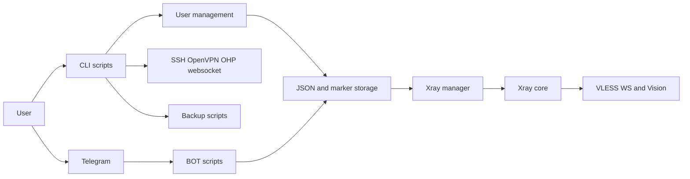

# Existing Architecture

Bash VPS toolkit for SSH, OpenVPN, websocket services, and Xray. Entry point is `setup-lite.sh`; Xray setup is `SETUP/ins-xray.sh`; state is JSON, marker comments, logs, cron, and root files.

`setup-lite.sh` validates root/OpenVZ, collects domain/client/Telegram values, creates runtime directories, and downloads setup scripts from the supplied `Server_URL`. Runtime state is under `/usr/local/etc/xray`, `/var/log/xray`, `/root/yoloautosc`, `/var/lib`, `/home/vps/public_html`, systemd, and cron.
